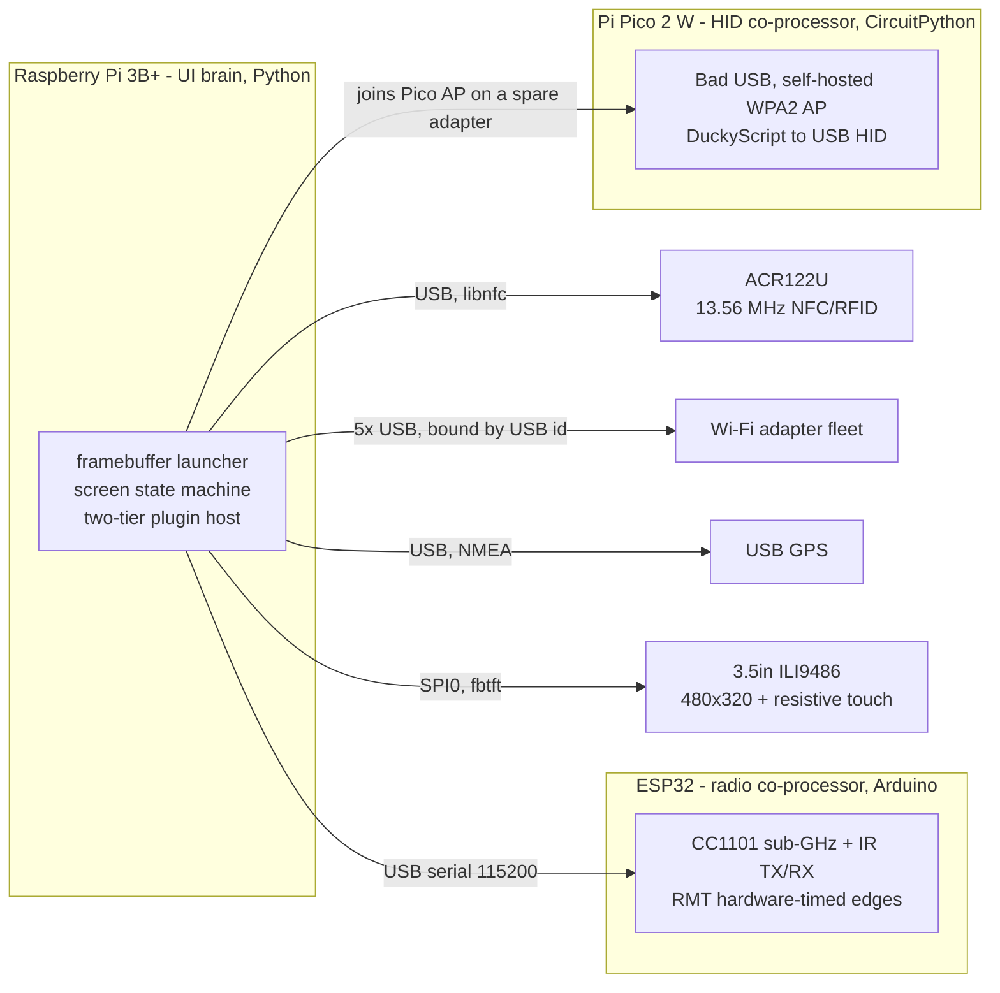
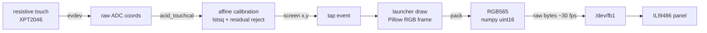
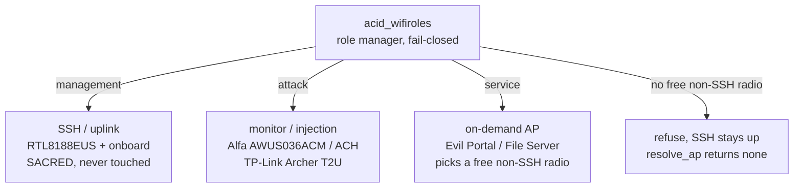
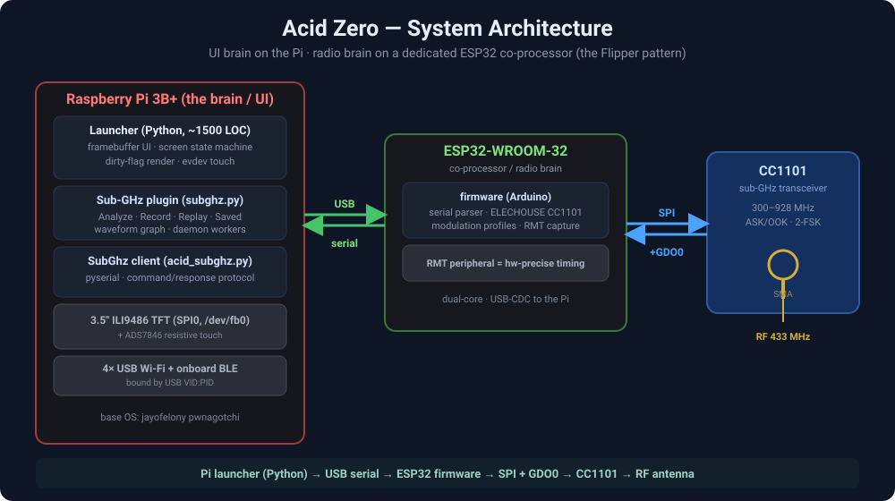

# Acid Zero — Architecture

How the system is put together: a **UI brain** on the Raspberry Pi, a dedicated **radio brain** on an ESP32 co-processor, and a clean serial contract between them. This is the same split a Flipper Zero uses (an MCU owns the radios; the application core just talks to it) — chosen here deliberately, for the reasons below.

## System overview

Acid Zero is a **three-processor** embedded system. The Raspberry Pi 3B+ owns the
touch UI and all high-level logic; two microcontroller co-processors handle the
real-time / physical-layer work a preempted Linux userspace process cannot do
reliably. Peripherals are attached over USB, SPI and I²C and bound deterministically.

### 1. Processor topology



### 2. Display + touch pipeline

The UI never touches a display server or GUI toolkit — the render path *is* the panel,
and touch comes back through a calibrated affine transform.



### 3. Wi-Fi adapter roles (fail-closed)

Multiple adapters let one radio stay a **sacred** management/SSH link while others do
monitor / injection or host an on-demand AP. The role manager **fails closed** — if the
only free adapter is carrying the live SSH session, it refuses rather than drop the link.





```
 Raspberry Pi 3B+ (Python)        ESP32-WROOM-32 (Arduino)         CC1101
 ┌───────────────────────┐  USB   ┌────────────────────────┐  SPI ┌──────────┐  RF
 │ framebuffer launcher   │ serial │ command parser         │ +GDO0│ sub-GHz  │ ))) SMA
 │  └ Sub-GHz plugin      │◄──────►│  └ ELECHOUSE CC1101    │◄────►│ ASK/OOK  │
 │     └ SubGhz client    │ 115200 │  └ RMT cap, bit-bang TX│      │ 2-FSK    │
 └───────────────────────┘        └────────────────────────┘      └──────────┘
   screen state machine             modulation profiles
   waveform UI · pyserial           hardware-precise timing
```

---

## 1. Why a co-processor (the key decision)

The Pi already drives a 3.5" SPI TFT (fbtft on **SPI0**) plus touch. The CC1101 also wants SPI, and — critically — raw sub-GHz **OOK timing capture needs microsecond-precise edge timing** that a Linux userspace process (preempted, no real-time guarantees, `pigpio` absent on Debian Trixie) cannot deliver reliably. Bit-banging from the Pi produced inconsistent pulse counts.

**Decision:** move the radio to an **ESP32**, whose **RMT peripheral** does hardware-timed edge capture/generation. The Pi never touches the CC1101 — it sends short text commands over USB serial and renders results. Benefits:

- **Determinism** — RMT captures every edge in hardware → consistent frames (the Pi-interrupt approach drifted 43–60 pulses; RMT is fixed).
- **No bus contention** — TFT keeps SPI0; CC1101 lives on the ESP32's own SPI.
- **Separation of concerns** — UI/state on the Pi, real-time RF on the MCU. The same co-processor can later host IR (RMT), NFC (I²C), and a joystick.

---

## 2. Components

| Layer | File / part | Responsibility |
|-------|-------------|----------------|
| UI / state | `launcher/acidzero.py` | framebuffer render loop, screen state machine, touch, plugin host |
| Sub-GHz app | `apps/subghz.py` | the Sub-GHz UI (one combined view), daemon workers, waveform graph |
| Transport | `launcher/acid_subghz.py` | `SubGhz` pyserial client — auto-detects the ESP32, command/response |
| Firmware | `firmware/esp32-cc1101/esp32-cc1101.ino` | serial command parser, CC1101 config, RMT capture, bit-bang TX |
| Radio | CC1101 (E07-M1101D) | 300–928 MHz ASK/OOK + 2-FSK transceiver |

**Wiring:** see [`docs/wiring-cc1101-esp32.svg`](docs/wiring-cc1101-esp32.svg). CC1101 → ESP32: SCK=D18, MOSI=D19, MISO=D23, CS=D5, GDO0=D4, 3V3, GND.

---

## 3. Serial command protocol (Pi → ESP32)

Line-based ASCII over USB serial @ 115200. Every command returns a one-line (or short multi-line) reply. Backward-compatible and human-debuggable.

| Command | Reply | Purpose |
|---------|-------|---------|
| `PING` | `PONG` | liveness / port auto-detection |
| `VER` | `VER partnum=.. version=0x14 present=YES` | confirm the CC1101 is alive |
| `INFO` | pins · freq · profile · mod · rxbw · drate | current config |
| `FREQ <mhz>` | `FREQ set <mhz>` | set frequency |
| `RSSI` | `RSSI <mhz> = <dbm>` | one RSSI reading |
| `SCAN` / `ANALYZE` | per-freq RSSI + `peak=<mhz> rssi=<dbm>` | frequency analyzer (peak-hold sweep) |
| `MOD <profile>` | applied profile | switch modulation preset |
| `SET_CONFIG --freq --mod --drate --dev --rxbw --rssi` | echo of the new config | custom override |
| `CLASSIFY` | RSSI-swing heuristic → ASK/OOK vs FSK | identify modulation type |
| `CAPTURE [s]` | `CAP n=<count>` + `CAPDATA <us...>` | RMT raw OOK capture (full timing) |
| `LOAD <us...>` | `LOAD n=<count>` | load a saved signal into the TX buffer |
| `REPLAY [x]` | `REPLAY done` | transmit the loaded/last signal x times |

### Modulation profiles (CC1101 register sets)

| Profile | Modulation | RX BW | Data rate | Use |
|---------|-----------|-------|-----------|-----|
| `AM_DEFAULT` | ASK/OOK | 162 kHz | 2.4 kbps | clean baseline |
| `AM_WIDE` | ASK/OOK | 650 kHz | 4.0 kbps | wide remotes (AM650) |
| `AM_NARROW` | ASK/OOK | 270 kHz | 3.8 kbps | AM270 remotes |
| `FM_FSK` | 2-FSK | 270 kHz | 5.0 kbps, dev 47.6 kHz | FM remotes |

---

## 4. The Sub-GHz signal pipeline

```
 IDENTIFY                 CAPTURE (as-is)            STORE                 REPLAY
 ┌─────────┐  freq+mod   ┌──────────────┐  raw us   ┌───────────────┐    ┌──────────────┐
 │ ANALYZE │────preset──►│ RMT edge      │──────────►│ preset+frame  │───►│ set freq+mod │
 │ +CLASSIFY│            │ capture(GDO0) │           │  /home/.sub   │    │ LOAD + TX    │
 └─────────┘            └──────────────┘           └───────────────┘    └──────────────┘
```

**Preset = the asset.** A captured signal is stored together with the **exact frequency and modulation** it was received on, so replay reproduces it bit-for-bit:

```
sig_name.sub :  <freq_MHz> <modulation_profile> <pulse_us> <pulse_us> ...
example      :  433.92 AM_NARROW 350 900 350 900 1100 350 ... 5100
```

The capture is stored **as-is** (full raw, including inter-frame gaps and repeats), phase-aligned to the first carrier-ON edge, so the replayed framing matches the original transmission — not a re-synthesized approximation.

---

## 5. State machines

### 5.1 Launcher screen state machine (Pi)

```
        tap tile                         < back (top-left)
 home ───────────► <app screen> ─────────────────────────► home
   ▲                  │ (plugin: on_enter → draw → handle_touch)
   │ first boot       ▼
 consent ── accept ─► home          plugins dispatched by name:
                                    screen == META.name  →  PLUGINS[screen]
```

### 5.2 Sub-GHz plugin view machine

```
                 SAVED ►
        ┌──────────────────────► saved ──── tap row ──► (replay worker)
        │                          │  ◄── MAIN ─────────┘  X ► (delete worker)
 main ──┤
        │  SAVE (have signal)
        └──────────────────────► savename ── OK ──► (save worker) ──► main
                                     └── CANCEL ──► main
 main buttons: SCAN · AUTO · RECORD · REPLAY · SAVE   (all spawn daemon workers)
```

### 5.3 ESP32 capture/replay state (firmware)

```
 IDLE ──CAPTURE──► async-RX ──RMT read──► parse symbols ──► IDLE   (buffer holds raw)
 IDLE ──REPLAY───► async-TX ──bit-bang GDO0 (x reps)─────► IDLE
        (mode switched via PKTCTRL0 + IOCFG0; profile applied before each)
```

**Concurrency model (Pi):** the framebuffer render loop never blocks. Every serial round-trip (seconds long) runs on a **daemon worker thread** guarded by a single `_busy` lock; workers mutate shared state and raise the dirty flag; `draw()` only reads.

---

## 6. Engineering decisions, in one place

- **RMT over interrupts** for capture — hardware timing → deterministic pulse counts.
- **Preset travels with the signal** — freq + modulation saved alongside the raw timing → exact replay.
- **Async serial OOK** on the CC1101 (PKTCTRL0 async, GDO0 = serial data) for raw timing, not FIFO/packet mode.
- **Phase alignment** — capture starts at the first carrier-ON edge so TX polarity matches.
- **Port auto-detection** — the client probes `/dev/ttyUSB*` for the `PING→PONG` handshake (survives renumbering).
- **Drop-in plugin** — the Sub-GHz app is a plugin file; zero edits to the core launcher (it hooks the existing tile via the plugin dispatch).
- **Safe by default** — first-run consent gate; captive-portal credential capture off by default; transmit features are own-lab/authorized only.

---

## 7. Repository map

```
launcher/acidzero.py          framebuffer launcher (UI + state machine + plugin host)
launcher/acid_subghz.py       SubGhz pyserial client (transport + protocol)
apps/subghz.py                Sub-GHz UI plugin (combined interface + workers)
firmware/esp32-cc1101/        ESP32 co-processor firmware (CC1101 + RMT + serial)
docs/architecture.svg         this diagram
docs/wiring-cc1101-esp32.svg  CC1101 ↔ ESP32 wiring
```

Educational / authorized-use only — see [ETHICS.md](./ETHICS.md).
