# Acid Zero

> A Flipper-Zero-class handheld for **authorized** wireless-security research, built end-to-end on a Raspberry Pi 3B+ — a pure-Python framebuffer GUI, a deterministic multi-radio Wi-Fi/BLE stack, and a real two-tier plugin runtime, in ~4,400 lines of Python and Bash plus a ~400-line ESP32 firmware.

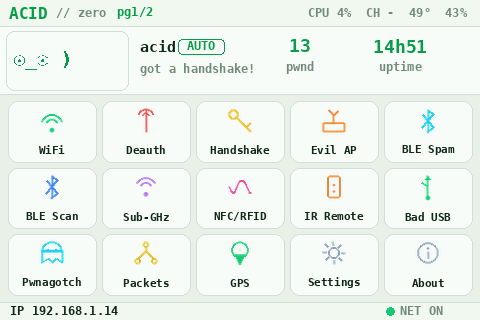

**Acid Zero** is a self-contained pentesting handheld — a custom touch UI and wireless toolkit layered on top of the [jayofelony pwnagotchi](https://github.com/jayofelony/pwnagotchi) base OS. The entire interface renders straight to the Linux framebuffer at ~30 fps on a single ARM core: no display server, no GUI toolkit, no web view. Four USB Wi-Fi adapters are bound deterministically by USB VID:PID (the onboard radio by its own hardware ID), Bluetooth LE goes out over raw HCI sockets, and the on-device documentation tool emits a valid PDF with zero external libraries because the target had none to depend on. The launcher alone is a single ~1,500-line Python file.

This is a portfolio / proof-of-work project: **embedded systems and systems programming first, security research second, product polish third.**

**Stack:** Python · Bash · Raspberry Pi · Linux framebuffer (`fbtft`) · `evdev` · Pillow · NumPy · BlueZ / raw HCI · bettercap · aircrack-ng · systemd
**Focus areas:** embedded systems · systems programming · Wi-Fi & BLE security · penetration-testing tooling · defensive security education

---

## Project status

| Module | Capability | Status |
|--------|-----------|--------|
| **Sub-GHz** (CC1101 + ESP32 co-processor) | Frequency Analyzer · OOK record / replay · modulation profiles (AM270/AM650/FSK) · named save library · live waveform UI | ✅ **Working** |
| WiFi Hunter | live AP/client scan, deauth (authorized), connect — via bettercap | ✅ Working |
| Radar (defensive suite) | deauth / BLE-spam / Flipper / evil-twin **detectors** (passive) | ✅ Working |
| Handshake Hunter | WPA handshake capture → Hashcat `.22000` | ✅ Working |
| BLE Scan / BLE Spam | rich device identification / advertising-spam demo | ✅ Working |
| Captive Portal Lab | rogue-AP + captive portal (demo; credential capture **off by default**) | ✅ Working |
| Pwnagotchi mirror / Live Packets | live agent display / read-only 802.11 recon | ✅ Working |
| Two-tier plugin runtime | in-process Python **+** native (C/C++/Rust/Go) plugins | ✅ Working |
| **Sub-GHz protocol decode** | EV1527 / Princeton 24-bit decode + round-trip verify; generic "PWM Nbit" fallback | ✅ **Working** |
| **Sub-GHz "Add Manually"** | build a replayable EV1527 frame from a hex key, on-device | ✅ **Working** |
| IR (transmit / receive) | capture + replay remotes, universal remote | 🚧 In progress |
| NFC / RFID (PN532) | read / emulate tags (I2C) | 🗓️ Planned |

> The Sub-GHz radio runs on a dedicated **ESP32 co-processor** (CC1101) talking to the Pi over USB serial — hardware-precise RMT capture, modulation-aware record/replay, all driven from the on-device touch UI. The ESP32 firmware (source **+ a ready-to-flash binary**) ships in [`firmware/`](firmware/) — flash it in one command.

---

> ## ⚠️ AUTHORIZED USE ONLY — READ BEFORE YOU CLONE
>
> This is an **authorized wireless-security education & research tool** with real offensive
> capability — Wi-Fi deauthentication, rogue-AP / captive-portal credential-harvesting
> **simulation**, BLE advertising spam, and WPA handshake capture — where **every offensive
> technique ships paired with its own detection & defense lesson**. It is published **strictly
> for education, defensive research, and testing networks and devices you own or are explicitly
> authorized in writing to assess.**
>
> **Using these features against networks, devices, or people without prior, explicit,
> written authorization is illegal** in most jurisdictions (e.g. US CFAA 18 U.S.C. §1030
> & Wiretap Act; UK Computer Misuse Act 1990; India IT Act 2000 §43/§66; UAE Federal
> Decree-Law No. 34/2021; EU member-state equivalents) and can carry **criminal liability**.
> Transmitting deauth/jamming frames may **independently violate radio/telecom regulations**
> (FCC, Ofcom, India WPC/TRAI, UAE TDRA).
>
> By downloading, building, or running this software you accept the full
> **[ETHICS.md](./ETHICS.md)** and the license. This repository deliberately ships **no
> destructive/DoS payloads** by design. **You alone are responsible for what you do with it.**
> The author accepts **no liability** for misuse. If you don't have written permission for
> the target, **stop here.**

---

## Highlights

The hard parts — the reasons this is worth a reviewer's time. The recurring theme is **deterministic behavior on hardware that reshuffles device numbers (`fb#`, `event#`, `wlanN`) on every boot**, and self-contained tooling that assumes nothing is installed.

- **Pure-Python GUI, no toolkit.** Each frame is composited as a Pillow image, packed to 16-bit **RGB565**, and written as raw bytes to `/dev/fb1` (480×320). No Qt, no LVGL, no SDL, no web stack — the render path *is* the panel.
- **~30 fps on a single ARM core.** A **dirty-flag render loop** repaints only when state changes or a refresh interval elapses; background daemon threads own all I/O (network, recon, the live face). The UI stays responsive while recon runs, without busy-painting unchanged pixels.
- **Custom resistive-touch stack with real calibration math.** Reads the ADS7846 panel via the raw Linux **evdev** device and solves a **4-point affine calibration with least-squares (`numpy.lstsq`)**, gated by a **residual-error check** that *rejects* a bad calibration instead of silently shipping a misaligned screen.
- **Two-tier plugin runtime.** In-process Python plugins (`META` + `draw(d, ctx)`, hot-discovered via `importlib`, handed a `Ctx` facade of helpers/colors/fonts) **and** native-binary plugins (an `app.json` manifest + a compiled executable in *any* language — C/C++/Rust/Go — run fullscreen via a blocking subprocess that owns the framebuffer and touch, then cleanly returns control). Documented contract + working template ([`apps/hello-native/`](apps/hello-native/)) ship in the repo.
- **Five-radio management bound by hardware ID.** Four USB Wi-Fi adapters (by USB VID:PID) plus the onboard radio — because `wlanN` names reshuffle every boot. The boot-order race is solved deterministically.
- **Zero-dependency PDF generator.** The hardware-reference tool **hand-writes a valid PDF 1.4 file** — objects, xref table, content streams, base-14 fonts — with no library, because the Pi had none installed. Also emits styled HTML.
- **Raw HCI socket BLE.** Bluetooth-LE advertising is driven directly over the **HCI USER channel**, not through a high-level helper.
- **Reuses the radio's existing owner.** Wi-Fi recon and deauth go through pwnagotchi's existing **bettercap REST API** rather than spawning a second `airodump-ng` to fight over the monitor interface. One owner of the radio, no contention; cross-channel deauth driven by bettercap.

---

## 🏗️ System Architecture & Hardware Stack

A **distributed co-processor model** — keeping real-time radio work off the core so it never blocks the primary UI framebuffer:

- **Main Core (the brain):** Raspberry Pi 3B+ running Python-based **framebuffer state management** and **concurrent plugin orchestration** — it owns the display, the resistive touch panel, and the Wi-Fi/BLE radios.
- **Radio Co-Processor:** an **ESP32** handling raw, **hardware-precise pulse timing via its RMT peripheral** to interface with the **CC1101** transceiver over **SPI** — linked to the Pi over **USB serial @ 115200**. Source + a ready-to-flash binary live in [`firmware/`](firmware/) (flashing guide: [`firmware/README.md`](firmware/README.md)).

> 📐 **Full system architecture** — the Pi ↔ ESP32 ↔ CC1101 split, the serial protocol, the signal pipeline, and the state machines: **[ARCHITECTURE.md](./ARCHITECTURE.md)**

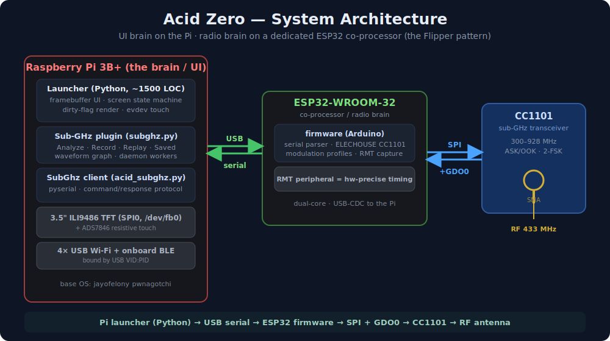

One Python process, many threads. All UI lives on the render thread; every I/O path is offloaded to a daemon thread that only mutates shared state and raises a `dirty` flag.

```
                       Acid Zero launcher  (launcher/acidzero.py, ~1500 LOC)
                                  single Python process
  ┌────────────────────────────────────────────────────────────────────────┐
  │  RENDER THREAD (≈30 fps, dirty-flag gated)                               │
  │    Pillow Image (480x320 RGB)  ──►  RGB565 pack  ──►  write /dev/fb1     │
  │    widgets · paged icon grid · live face · light/dark theme engine      │
  └───────────────▲──────────────────────────────────────────┬─────────────┘
                  │ shared state + dirty flag                  │ owns fb+touch
  ┌───────────────┴───────────────┐                ┌──────────▼─────────────┐
  │ BACKGROUND DAEMON THREADS      │                │ NATIVE PLUGIN (blocking)│
  │  touch: raw evdev → affine map │                │  app.json + exec        │
  │  recon: bettercap REST poll    │                │  C/C++/Rust/Go, fullscr │
  │  face/state, BLE, packet recon │                │  subprocess → resume    │
  └───────────────┬───────────────┘                └─────────────────────────┘
                  │
  ┌───────────────┴──────────────────────────────────────────────────────────┐
  │ DEVICE / RADIO BINDING LAYER                                               │
  │  display+touch by NAME (fb#/event# reshuffle)                              │
  │  4x USB Wi-Fi + onboard bound by USB VID:PID (wlanN reshuffles)           │
  └───────────────┬──────────────────────────────────────────────────────────┘
                  │
  ┌───────────────┴──────────────────────────────────────────────────────────┐
  │ BASE OS — jayofelony pwnagotchi                                            │
  │  bettercap REST API  ·  aircrack-ng  ·  hostapd/dnsmasq  ·  bluez · fbtft  │
  └───────────────────────────────────────────────────────────────────────────┘
```

**Render path:** daemon threads update shared state and set the dirty flag → the render loop composes a Pillow frame → packs to RGB565 → writes raw bytes to `/dev/fb1`.

**Input path:** evdev reads from the ADS7846 device (found *by name*) → raw samples pass through the affine calibration matrix → UI hit-testing.

**Plugin discovery:** `importlib` hot-loads Python apps from the apps dir; native apps are discovered by their `app.json` manifest and launched as fullscreen blocking subprocesses that take ownership of the framebuffer and touch. The grid auto-pages when there are more apps than fit on a screen.

**Design choices that matter:**

- **One process, many threads** — UI on one thread, I/O offloaded; nothing blocks the render loop on a network call.
- **Reuse the radio owner** — recon/deauth ride pwnagotchi's existing bettercap session instead of contending for the monitor interface.
- **Name/ID-based device resolution everywhere** — nothing depends on enumeration order the kernel is free to change between boots.

### Physical Implementation Rig

Acid Zero moving past theoretical concepts — a real-world build on a Raspberry Pi core, extended with a dedicated **ESP32 radio co-processor** (over USB serial) plus **custom SPI/GPIO pin-mapping** for the display and the CC1101 transceiver. High-gain **ALFA-class USB Wi-Fi** adapters give long-range 802.11 telemetry (BLE recon runs on the Pi's onboard radio), with **direct SPI routing to the CC1101** for sub-GHz scanning.

<p align="center">
  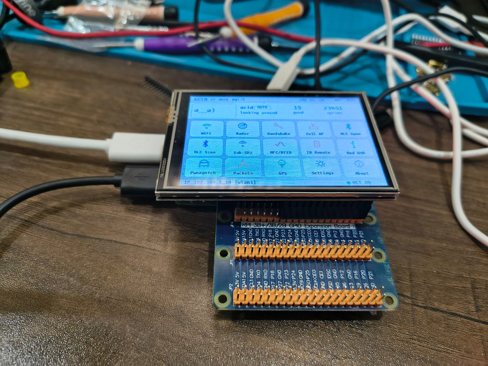
  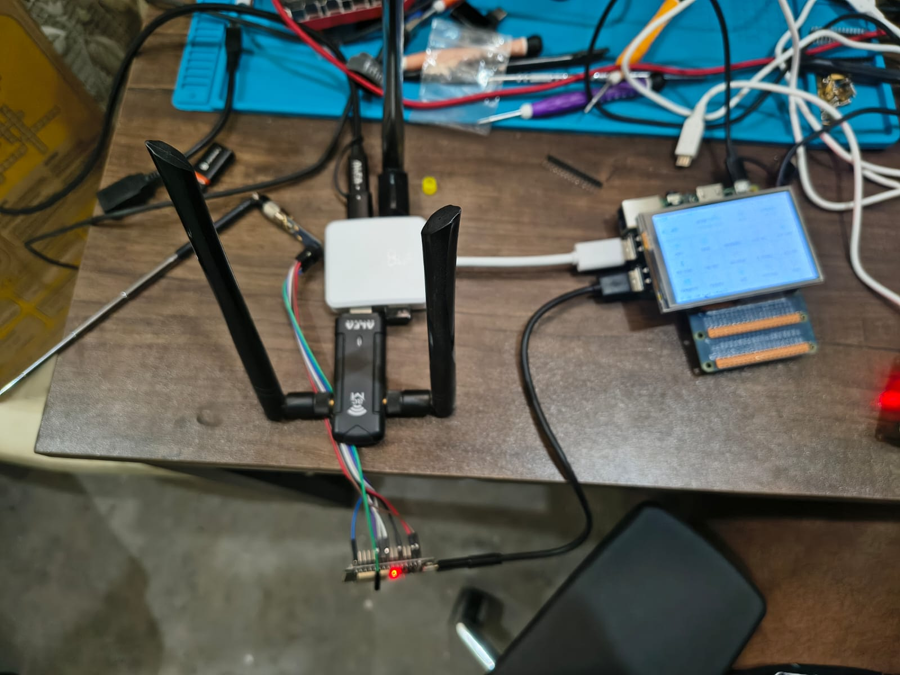
</p>
<p align="center"><sub><b>Left:</b> the handheld — Pi 3B+ + ILI9486 touch TFT running the framebuffer launcher. &nbsp; <b>Right:</b> the controlled, self-owned RF lab bench — multi-radio Wi-Fi rig + the ESP32/CC1101 sub-GHz co-processor.</sub></p>

---

## Features / Apps

Each app is a screen in the UI.

<p align="center">
  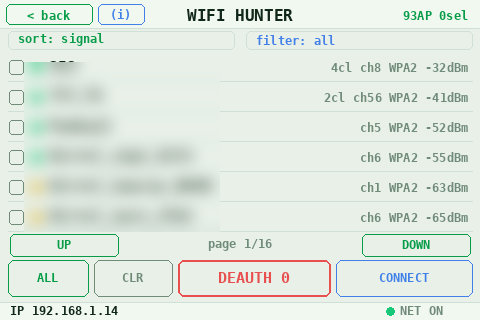
  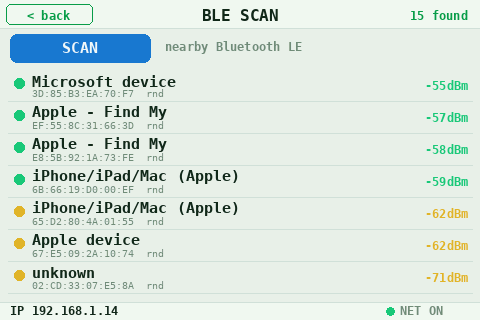
  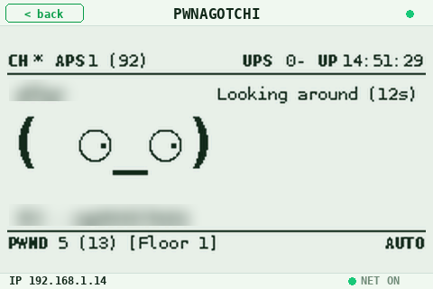
</p>

| App | What it does |
|-----|--------------|
| **WiFi Hunter** | Live AP list (signal / channel / encryption / clients) with sort, filter, multi-select, pagination; deauth (authorized testing) and connect — driven through the bettercap REST API. |
| **Captive Portal Lab** | Rogue-AP + captive-portal **credential-harvesting simulation** (`hostapd` + `dnsmasq` DNS-hijack + a Python captive portal) with templates: generic Wi-Fi / Google / router / social. **Credential capture is OFF by default** — the portal records only a masked submission count; raw capture is gated behind an explicit own-lab flag. For authorized social-engineering assessments and education — a simulation, never to be pointed at real users. |
| **Handshake Hunter** | WPA handshake capture (`airodump-ng` + `aireplay-ng`), converted to Hashcat **`.22000`** via `hcxpcapngtool`. |
| **BLE Scan** | Rich BLE device identification — decodes advertising reports (manufacturer Company-ID → vendor, OUI, name, GAP appearance, Apple Continuity model, Google Fast-Pair model) into human labels like *"AirPods Pro (Apple)"* or *"iPhone/iPad/Mac"*. Lookup tables compiled from the Bluetooth SIG Company-ID list, the IEEE OUI registry, and reverse-engineered Apple Continuity / Google Fast-Pair model IDs. |
| **BLE Spam** | BLE advertising spam (Apple / Google / Samsung / Microsoft proximity-pairing popups) over raw HCI sockets; modular per-vendor payload files. Educational demonstration of BLE advertising abuse. |
| **Live Packets** | Read-only 802.11 frame recon — frame-type breakdown, top talkers, probe-request leaks. |
| **Pwnagotchi mirror** | Renders the live pwnagotchi display by fetching its rendered web `/ui` frame and theme-colorizing it — integrates the underlying AI-agent base OS. |
| **Hardware Info** | Live on-device hardware reference (board, display bus, touch, radios, free I2C/SPI buses). |
| **System & Power** | Start/stop services, restart the UI, reboot / shutdown. |
| **Settings** | Theme toggle (live light/dark swap, every color swaps at runtime), touch calibration. |

<details>
<summary><strong>Full screenshot gallery (14 screens)</strong></summary>

| | | |
|---|---|---|
|  | 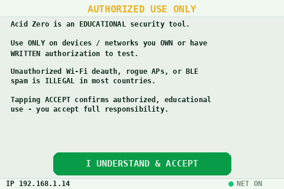 | 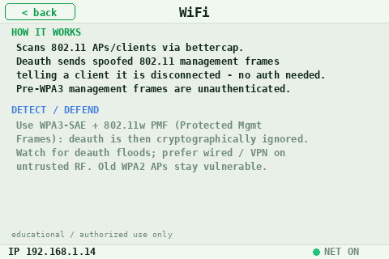 |
| Home | First-run consent gate | In-app Learn (attack ↔ defense) |
|  |  | 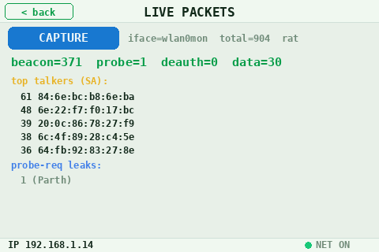 |
| WiFi Hunter | BLE Scan | Live Packets |
|  | 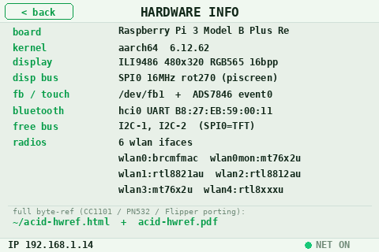 | 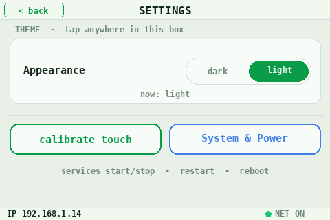 |
| Pwnagotchi mirror | Hardware Info | Settings |
| 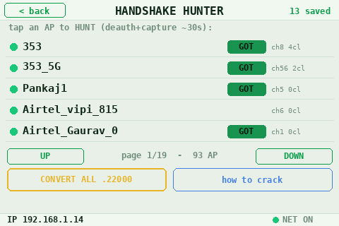 | 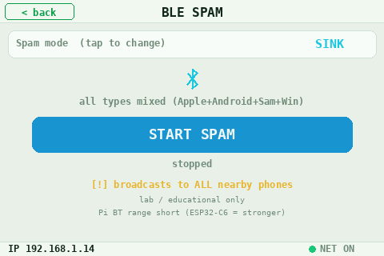 | 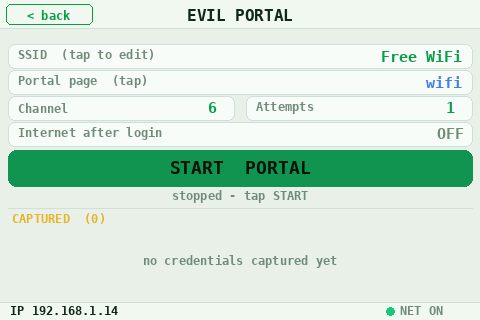 |
| Handshake Hunter | BLE Spam | Captive Portal Lab |
| 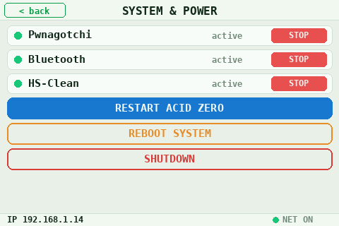 | 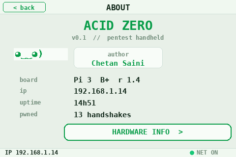 | |
| System & Power | About | |

</details>

---

## 🧩 Custom Plugin Support (App Engine)

Acid Zero is extensible — the launcher is a **plugin host**, not a fixed menu. Two ways to add apps, neither touching the core:

- **UI apps (`.py`)** — drop a Python file into the plugin directory (`/usr/local/lib/acid-apps/`). Export a `META` dict plus `draw(d, ctx)` / `handle_touch(tx, ty, ctx)`; it's hot-discovered via `importlib`, slotted into the framebuffer state machine, and handed a `Ctx` facade of fonts/colors/draw helpers. *(The Sub-GHz app itself is exactly this — a single plugin file.)*
- **Native apps (`app.json` + binary)** — ship a manifest and a compiled executable in **any** language (C / C++ / Rust / Go). It runs fullscreen via a blocking subprocess that takes ownership of the framebuffer + touch, then cleanly hands control back. Working template + contract: [`apps/hello-native/`](apps/hello-native/).

**Extending the radio side:** the **ESP32 co-processor** firmware is open and reflashable — add a new sub-GHz/IR protocol handler in the `.ino`, reflash in one command ([`firmware/README.md`](firmware/README.md)), then drive it from a `.py` UI app over the serial protocol. The free **SPI1 / I²C-1** buses for new modules (CC1101, PN532, …) are mapped in [`docs/hardware-reference.pdf`](docs/hardware-reference.pdf).

---

## Educational design

Acid Zero is built to **teach**, not just to run attacks. Two features bake the
"educational, authorized-use-only" stance into the device itself — not just a disclaimer file:

- **First-run authorization gate.** On first boot the device shows a consent screen; nothing
  unlocks until the operator acknowledges they will only test devices and networks they own
  or are explicitly authorized to assess.
- **In-app Learn (attack ↔ defense).** Every offensive screen has an **(i)** button that opens
  a concise explainer — *how the technique works* **and** *how to detect and defend against it*.
  Deauth is paired with WPA3/PMF, the captive portal lab with captive-portal awareness, BLE spam with
  OS hardening, handshake capture with passphrase strength, and so on.

Every capability ships with its countermeasure. That pairing is the line between a script and a
security-**education** tool.

---

## Physical Hardware Stack & Hardware Sourcing

| Component | Detail |
|-----------|--------|
| SBC | Raspberry Pi **3B+** (1 GB) |
| Display | **ILI9486** 480×320 SPI TFT — `fbtft` `piscreen` overlay, **SPI0 @ 16 MHz** → `/dev/fb1` |
| Touch | **ADS7846** SPI resistive, read via raw `evdev` |
| Wi-Fi / BLE | Onboard Broadcom Wi-Fi + BT, plus **4× USB Wi-Fi dongles** via a powered hub |
| Radio co-processor | **ESP32-WROOM-32** (dual-core) — owns the CC1101 over SPI, USB-serial to the Pi |
| Sub-GHz | **CC1101** (E07-M1101D) — 300–928 MHz ASK/OOK + 2-FSK, on the ESP32's SPI |

Wi-Fi roles are bound by USB **VID:PID** so a `wlanN` reshuffle on reboot never breaks them:

| Role | Chipset |
|------|---------|
| Monitor + injection | MediaTek **MT7612U** |
| Rogue AP (Captive Portal Lab) | Realtek **RTL8812AU** |
| Client / SSH uplink | Realtek **RTL8821AU** |
| Auxiliary | Realtek **RTL8188EUS** |

### Bill of materials / sourcing

Everything is commodity, off-the-shelf hardware — no custom PCB. Substitutes in each row work; this is the exact rig in the photos above.

| Part | Model used | Notes / substitutes |
|------|-----------|---------------------|
| SBC | Raspberry Pi 3B+ (1 GB) | any Pi with a 40-pin GPIO header |
| Display + touch | ILI9486 3.5" SPI TFT (480×320) + ADS7846 | the common "RPi 3.5 inch" resistive shield |
| Radio co-processor | ESP32-WROOM-32 dev board | any ESP32 with ≥ 4 MB flash |
| Sub-GHz transceiver | CC1101 — E07-M1101D + SMA antenna | use an antenna for a band that is **legal to TX** in your region |
| High-gain Wi-Fi | ALFA-class USB adapters (MT7612U / RTL8812AU / RTL8821AU / RTL8188EUS) | monitor + injection capable; high-gain antennas |
| Power | powered USB hub | the radios need clean current — don't bus-power them off the Pi |
| Wiring | jumper wires + GPIO expansion board | for the CC1101 ↔ ESP32 SPI hookup |

> **Flashing the co-processor:** wiring diagram + one-command flash (prebuilt binary or build-from-source) are in **[`firmware/README.md`](firmware/README.md)**.

SPI0 on the Pi is fully consumed by the display + touch — which is exactly *why* the CC1101 lives on the ESP32 rather than fighting for the Pi's bus. The repo also documents the alternative **Pi-direct** porting path (CC1101 on **SPI1**) and the free **I2C-1** bus for a **PN532** NFC/RFID add-on. Porting reference: [`docs/hardware-reference.html`](docs/hardware-reference.html) / [`docs/hardware-reference.pdf`](docs/hardware-reference.pdf) — the PDF is generated on-device by the zero-dependency PDF writer.

---

## Demo / lab setup

Acid Zero is designed to run in a **controlled, self-owned RF lab** — that is its only intended environment:

- **Your own router** as the test AP — a spare/factory-reset router, never a production or shared network.
- **Your own phone / laptop** as the only client on the test network.
- **RF isolation + low power** — test in a quiet RF area and keep TX power low (the rogue-AP adapter at minimum power) so signals stay on your bench, not your neighbours'.
- **Credential capture OFF by default** — the captive portal lab records only a masked submission count for the demo. Raw capture is gated behind an explicit own-lab flag and must only ever face your own test client.
- **A first-run authorization gate** plus **per-screen Learn reminders** bake authorized-use into the device itself; active-transmit features (rogue AP, deauth, BLE spam) are clearly labelled and the captive-portal capture stays masked unless you explicitly opt into own-lab mode.
- **No real users, ever.** If a device you don't own can see the AP, or a person who hasn't authorized you could connect, you are in the wrong environment — stop.

This controlled-environment design is the line between a security-**education** project and a tool for abuse.

---

## Research notes / limitations

Instrumented testing showed that an **iPhone personal hotspot (WPA3-SAE + 802.11w PMF) is immune to both deauth and auth-flood by design** — Protected Management Frames defeat the attack class at the protocol level. This is documented as a real finding rather than buried, because knowing what *doesn't* work is as important as what does, and because PMF is exactly the correct defense. The platform's value is rigorous, repeatable measurement of what works and what doesn't — not a list of guaranteed exploits.

---

## Install

Built on the jayofelony pwnagotchi base OS; paths assume the pwnagotchi default `/home/pi`.

- **Runtime:** Python 3.11+, Pillow, numpy
- **Wi-Fi:** bettercap (via pwnagotchi), aircrack-ng suite, hcxtools (`hcxpcapngtool`), hostapd, dnsmasq
- **Bluetooth:** bluez (`btmgmt` / `btmon`), raw HCI sockets
- **Display:** Linux `fbtft`
- **Sub-GHz co-processor:** flash the ESP32 (CC1101) with one command — prebuilt binary or build-from-source: **[`firmware/README.md`](firmware/README.md)**

Full setup, flashing, overlay configuration, and service install are in **[INSTALL.md](INSTALL.md)**.

> The bettercap default credentials (`pwnagotchi:pwnagotchi`) are the published pwnagotchi default, not a secret.

### Repository layout

```
launcher/acidzero.py                         # the ~1,500-line UI launcher
apps/packets.py                              # in-process plugin example
apps/subghz.py                               # Sub-GHz UI plugin (capture/decode/add-manually)
apps/subghz_proto.py                         # OOK protocol codec (decode/encode/verify, pure)
apps/test_subghz_proto.py                    # codec unit tests (20 cases, no radio needed)
apps/hello-native/{app.json,hello.py}        # native-plugin template + contract
lib/acid-ble/
  hci.py                                     # raw HCI socket layer
  spam.py                                    # BLE advertising
  vendors/{apple,google,samsung,microsoft}.py
scripts/acid-{deauth,evilportal,handshake,packets,hs-clean,flood}.sh
scripts/acid-{ble-scan,portal-server,hwref}.py   # hwref = zero-dep PDF/HTML writer
systemd/{acidzero.service,acid-hs-clean.service,acid-hs-clean.timer}
firmware/esp32-cc1101/esp32-cc1101.ino       # ESP32 Sub-GHz co-processor firmware (source)
firmware/esp32-cc1101/prebuilt/*.merged.bin  # ready-to-flash ESP32 image (flash at 0x0)
firmware/{flash-windows.bat,flash-pi.sh}     # one-command ESP32 flashing
firmware/README.md                           # CC1101 wiring + flashing guide
docs/hardware-reference.{html,pdf}
docs/{device,setup}.jpg                      # real-hardware photos
docs/architecture.svg                        # system architecture diagram
docs/screenshots/*.png
```

---

## Ethics & Legal

This project exists to **build, understand, and detect** wireless-security techniques — not to attack strangers. It is intended **exclusively** for:

- Devices and networks **you own.**
- Engagements where you hold **explicit written authorization** to test (signed scope-of-work / rules of engagement).
- Controlled lab environments, CTF ranges, and education.

Key points:

- Deauthentication, rogue access points, captive-portal credential capture, and BLE advertising spam are **illegal** when used against networks or devices you do not own or are not authorized to test, in most jurisdictions (US CFAA, UK Computer Misuse Act, India IT Act, UAE Cybercrimes Law, EU equivalents).
- Wi-Fi deauth and BLE spam are *transmitting* operations — in many regions even harmless-looking transmission against third-party devices can independently violate radio/spectrum law.
- The captive-portal credential capture is a **simulation** for authorized social-engineering assessments and education — **disabled by default** (only a masked submission count is recorded; raw capture requires an explicit own-lab flag) and **never** to be deployed to collect real users' data.
- This repository deliberately contains **no destructive or denial-of-service payloads**. The "spam" and "deauth" tooling exists to *measure and demonstrate* known wireless-protocol weaknesses in authorized assessments — and, as the findings above show, to document where modern protections (WPA3-SAE, 802.11w PMF) defeat them.
- The author accepts **no liability** for any misuse.

If you can't say yes to *"do I own this, or do I have written permission to test it?"* — stop. Full policy: **[ETHICS.md](./ETHICS.md)**.

---

## License

Released under the MIT License — see **[LICENSE](LICENSE)**. The permissive license is intentionally kept clean; authorized-use terms live in [ETHICS.md](./ETHICS.md), not bolted onto the license. Built on the jayofelony pwnagotchi base OS — respect its license and the licenses of all bundled tools (bettercap, aircrack-ng, hostapd, dnsmasq, bluez).

---

## Author

**Chetan Saini** — senior software architect (14+ yrs) and security researcher. Filed CVE for the Releasit COD Form Shopify app (**CWE-602 + CWE-798**, MITRE candidate **#1999827**). GitHub: [@chetansaini53](https://github.com/chetansaini53) · Contact: **chetansaini53@gmail.com**

Built to demonstrate end-to-end depth: a hand-built framebuffer renderer, an evdev + least-squares touch stack, a deterministic multi-radio binding layer, a real native-plugin ABI, and a from-scratch PDF writer — assembled into a coherent, responsive handheld on constrained hardware.

---

## 🛠️ Credits

- **Core Logic & Hardware Architecture:** Chetan Saini
- **Code Assistance & Implementation:** Ella (AI Pair Programmer)

> **Note on Open Source & Transparency:** This project is heavily driven by custom hardware prototyping, breaking the limitations of low-level data buses, and multi-protocol setups. The system design and hardware orchestration are fully human-designed, while the codebase is optimized with the help of AI assistance.

**Contact:** Chetan Saini — **chetansaini53@gmail.com**